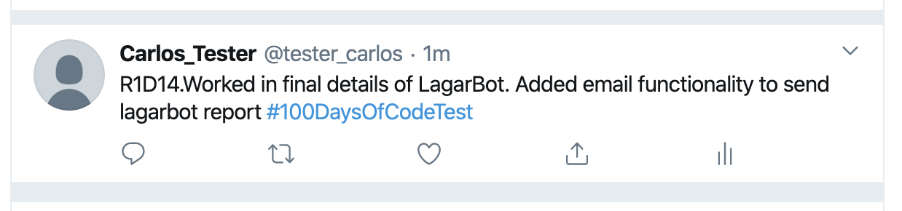

# Microverse's Ruby Capstone Project - ruby-twitter-bot

> This project consists of building a twitter bot that sends daily updates of my 100 days of code progress. It should be able to help me remember to commit updates on my 100-Days-of-code repo, and at the same time simplify my twitting workflow to publish my progress.

## Project's Video Presentation

[Lagarbot - ruby-twitter-bot ](https://www.loom.com/share/99420eb2648c423bb910aff5bde6e0b2)


# This project delivers on the following basic specifications
- When locally executed, the program checks a specified twitter account and repo to verify the update status.
- Reads through a specified file inside the github user's fork of 100-days-of-code: https://github.com/carlosmicro/100-days-of-code
- Checks for the '**Twitter:RXDYY' mark in the repo's record to identify a valid update.
- Checks the valid repo update against the last update available on twitter for the specified user.
- If repo update is ahead of twitter account, it will tweet the specified update automatically. 
- If no valid message content updated is available on the repository it will compile a report message.
- At the end of execution, the bot will send a detailed report of all performed actions to a specified email account.


## Built With

- Ruby, HTML
- Rubocop, Stickler, Rspec
- VS Code

## Getting Started

To get a local copy up and running follow these simple example steps.

### Prerequisites
To deploy a fully functional local copy, you must install the following dependencies/libraries: 
- [Twitter API Gem:](https://github.com/sferik/twitter) Managing Twitter search and Twitter updates (tweets)
- [Octokit Github Api Gem:](https://github.com/octokit/octokit.rb) Wrapper used to interact with github.com
- [Pony Gem:](https://github.com/benprew/pony) Used for email handling.

### Setup
- Clone this repository in your local enviroment
- Located on the root of repository execute 

 ```bundle install``` 
 
 This action will install all the required dependencies. 

 Create a .env file to include your own personalised access keys for all services. Hit the following command at the repositories root:

```touch .env```

### Configure Twitter API Gem

- Configure at the ```.env``` file your own twitter development account and consumer/access key/secret/tokens.

```For Twitter: Crete a developer's account and generate the following keys```

[Link for Twitter development account creation](https://developer.twitter.com/en/apply-for-access)

```ruby
    # Twitter access values for tester_carlos account
    export CONFIG_CONSUMER_KEY=dnaDAIY0kx9kmwx0sv4Bj4vZI
    export CONFIG_CONSUMER_SECRET=E5Kv1mgREoyObiRipvCx0UuzbEr6p3BP4OFrx43Y1rtshbz8yl
    export CONFIG_ACCESS_TOKEN=1237459699978682368-GrdAmvON8RK9SEPYZh1tfMfFknvTzM
    export CONFIG_ACCESS_TOCKEN_SECRET =Jp74ZAPe9TcaABIHwhKova0pVdS8iZuGYiiQn1rSLGO1w
```

### Configure Octokit

- Configure at the ```.env``` file your own octokit access constants for your github account


```ruby
# Octokit Access Constants
export GITLOG=<github_user>
export GITPASS=<account password
export GITREPO=<github_user>/<repo name>
export FILEPATH=/<file_name_at_root>
```
### Install and Pony email gem

- Configure at the ```.env``` file your own pony email access constants.

```For pony email, SMTP email server is configured in lib/robo_duties.rb file```

```ruby
# email - gmail account data
export EMAIL_LOGIN=carlos.el.coder
export EMAIL_PASS=microverse2020
```
```ruby
# Current SMTP email parameter are defined for GMAIL. Change them at your requirement.
    def mail_init(message)
    { to: 'YOUR OWN EMAIL',
    subject: '',
    headers: { 'Content-Type' => 'text/html' },
    body: " #{message}",
    via: :smtp, via_options: {
        address: 'smtp.gmail.com',
        port: '587',
        user_name: EMAIL_LOGIN,
        password: EMAIL_PASS,
        authentication: :plain,
        domain: 'gmail.com'
    } }
    end
```

### Usage
- To start the program, run ```bin/./main.rb``` at the root of your repositories local copy

### Run tests
- Assuming EnviVars are correctly defined, login into the update file https://github.com/carlosmicro/100-days-of-code/blob/master/r1-log.md
- Login into the twitter test account and erase all the twitts.
- Execute the bot ```bin/./main.rb```
- The local prompt should show the following response:

```carlos@Carloss-MBP ruby-twitter-bot % bin/./main.rb 
checking last tweet update on #100daysofCodeTest for handle : @tester_carlos
failing to get a valid tweet publishd with #100daysofCodeTest hash... for user @tester_carlos
building into report to @tester_carlos 
checking github @carlosmicro/100-days-of-code
getting : R1D14 - 'R1D14.Worked in final details of LagarBot...'
twitting available update in repo R1D14.
email sent
```
- Soon after this prompt is received, the twitter account should update to:



### Deployment

For further testing purposes, this bot could be deployed in a small server like raspberry pi 3. 

In this server, a cronjob could be defined to execute the ```lagarbot``` program every 24 hs, to ensure a daily check of progress updates to the #100-days-of-code community. 


## Authors

👤 Carlos Anriquez

- Github: [@canriquez](https://github.com/canriquez)
- Twitter: [@cranriquez](https://twitter.com/cranriquez)
- Linkedin: [linkedin](https://www.linkedin.com/in/carlosanriquez/)


## 🤝 Contributing

Contributions, issues and feature requests are welcome!

Feel free to check the [issues page](issues/).

## Show your support

Give a ⭐️ if you like this project!

## Acknowledgments

- [Twitter API Gem](https://github.com/sferik/twitter) 
- [Octokit Github Api Gem](https://github.com/octokit/octokit.rb) 
- [Pony Gem](https://github.com/benprew/pony)
- @microverse / The Corgis
- My Family!

## 📝 License

This project is [MIT](lic.url) licensed.
